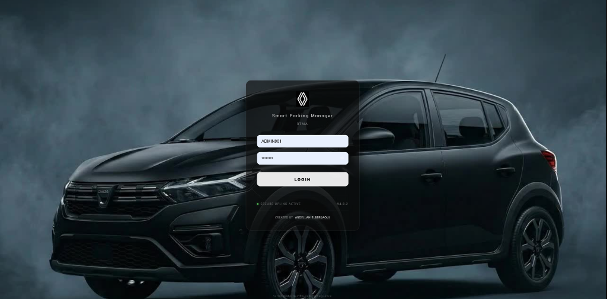
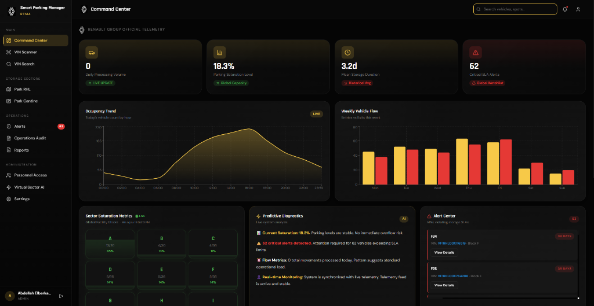
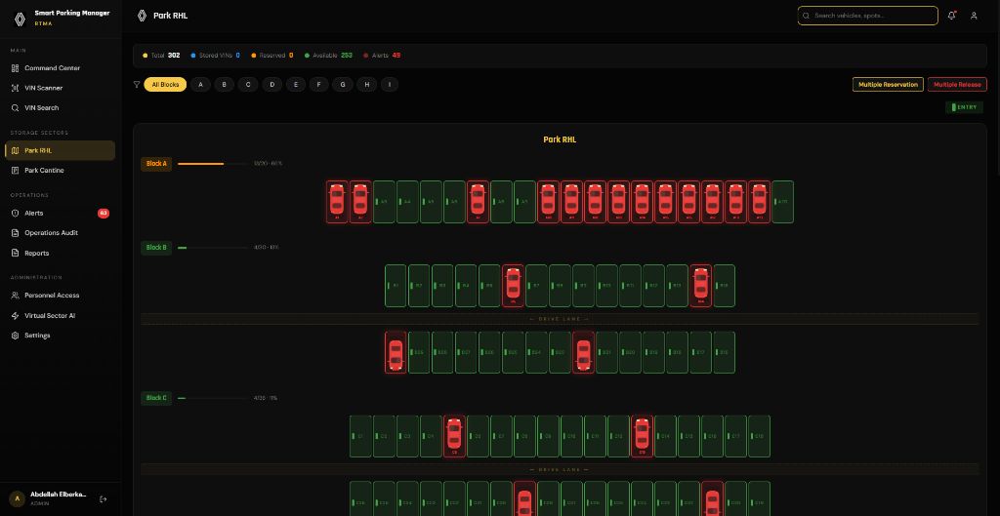
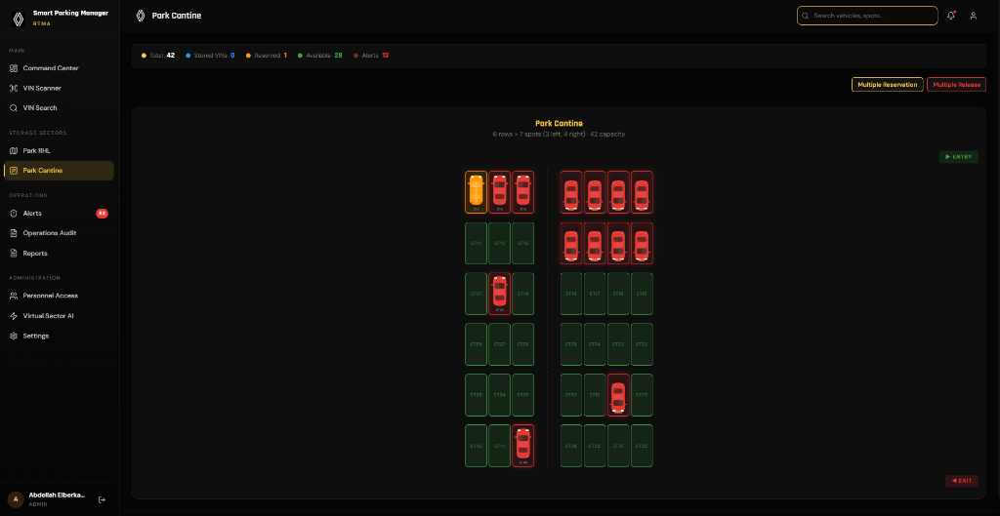
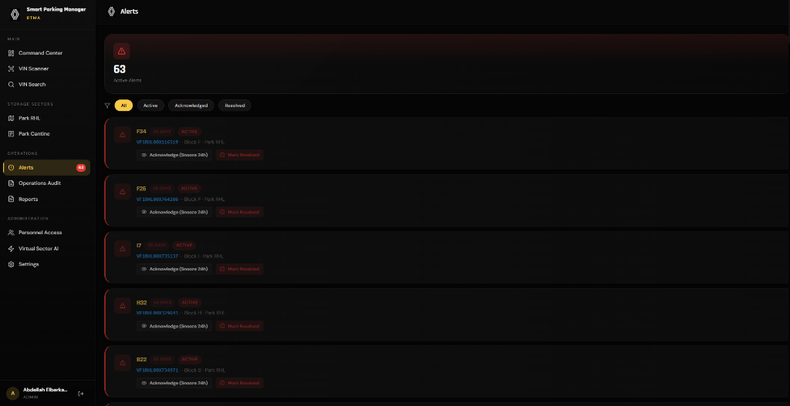
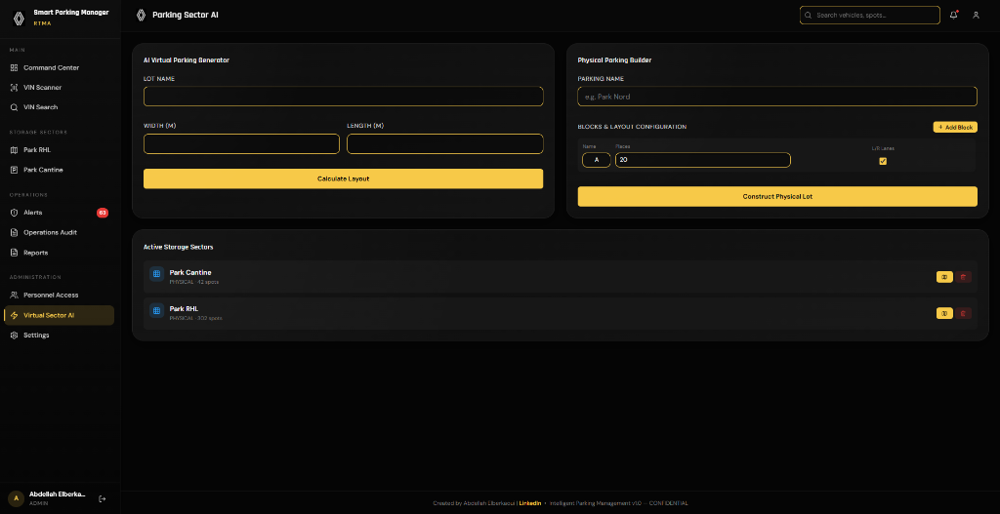
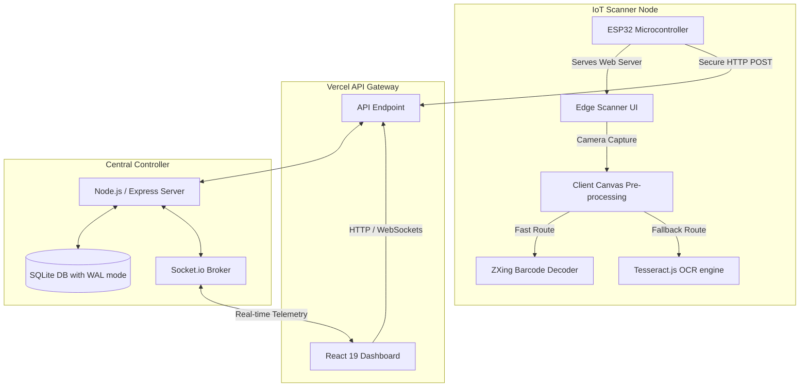

# 🚗 Renault Smart Parking Manager (SPM) - RTMA

A premium, industrial-grade, full-stack real-time parking management system designed for **Renault Group's** internal logistics, vehicle storage yards, and compound facilities (Park RHL, Park Cantine).

This repository integrates a modern web command center with an **IoT-based hardware scanner (ESP32)** to automate entry, exit, and real-time localization of transit vehicles.

[](#)
[](#)
[](#)

---

## 📸 System Showcase

### 1. Command Center Portal
An elegant glassmorphic authentication gateway providing a secure uplink to the central server.


### 2. Live Telemetry Dashboard
Real-time KPI telemetry monitoring system processing volume, storage saturation, mean storage durations, and active SLA alerts. Features custom Recharts visualization for hourly occupancy trends and weekly vehicle flow.


### 3. Interactive 2D Yard Maps (Park RHL & Park Cantine)
Bespoke, reactive maps representing actual parking grids (A-I). Spots are color-coded (Green for Available, Red for Occupied, Yellow for Reserved) with support for multi-reservation and bulk-release operations.



### 4. SLA Alert Center & AI Diagnostics
Automated monitoring of container/vehicle dwell times with visual alerts for vehicles breaching the logistics SLAs (6-day max limit). AI-assisted predictive diagnostics summarize system bottlenecks.



---

## 🛠️ System Architecture



### 1. Frontend Command Center
- **Framework & Build**: React 19 + Vite for rapid modular loading.
- **State Management**: Zustand (atomic, reactive store) ensuring zero-lag state synchronization.
- **UI/UX Aesthetics**: Bespoke CSS variables with premium dark themes, glassmorphism, Framer Motion micro-animations, and Lucide React iconography.
- **Analytics**: Recharts engine graphing vehicle ingress/egress velocities and yard capacity saturation.

### 2. Central Backend & Telemetry Broker
- **Runtime**: Node.js + Express REST API.
- **Database**: SQLite optimized with WAL (Write-Ahead Logging) mode, enabling swift multi-user write operations.
- **Real-Time Pipeline**: Socket.io serving instantaneous telemetry feeds to all connected dashboards.
- **Security**: Stateless JWT validation, bcrypt password hashing, Helmet headers, and CORS control.

### 3. IoT Edge Device (ESP32) & Computer Vision
- **Hardware Controller**: ESP32 microcontroller with a static IP configuration to bypass DHCP overhead and guarantee connection predictability.
- **Firmware Server**: Serves a lightweight web interface directly to operator smartphones, enabling camera capture.
- **Dual Computer Vision Pipeline**:
  1. **Primary - ZXing Decoded Barcode**: Instant barcode extraction from VIN labels.
  2. **Secondary - Tesseract OCR Fallback**: If the barcode is worn or dusty, an inline OCR worker extracts the 17-character alphanumeric VIN, verifying standard ISO 3779 formats (omitting `I`, `O`, `Q`).
- **Autonomic Ingress/Egress Logic**:
  - The ESP32 submits a scan payload.
  - The backend verifies if the vehicle is currently parked.
  - **If Parked**: Instantly executes a `/scan-exit`, releasing the spot, updating database counts, and broadcasting the event.
  - **If New Inbound**: Executes `/scan-entry`, locating the next optimal vacant slot, mapping it to the VIN, and prompting the operator with the assigned spot.

---

## 🔌 Hardware Setup (ESP32)

### Pinout & Wiring Specifications
The project utilizes a standalone **ESP32 Dev Module** acting as a local server.
- **GPIO 2 (Built-in LED)**: Used as status indicator (Blinks fast during AP/WiFi search, stays solid when connected).
- **Communication Protocol**: Dual-band Wi-Fi connection configured with static parameters:
  - **Static IP**: `192.168.1.222`
  - **Gateway**: `192.168.1.1`
  - **Subnet**: `255.255.255.0`

### Dual-Pipeline Web Scanner Diagram
```text
  [Camera Capture] ---> [Canvas Grayscale/Contrast Filter]
                               |
            +------------------+------------------+
            | (High Speed Route)                  | (Fallback Route)
            v                                     v
   [ZXing Barcode Engine]               [Tesseract OCR Engine]
      Detects VIN Code                    Filters Alphanumeric VIN
            |                                     |
            +------------------+------------------+
                               |
                               v
                     [17-Char Standard VIN]
                               |
                 [POST to Vercel Gateway REST API]
```

---


## 🛡️ Enterprise Grade Logistics Policy
This software is designed as a template for Renault Group Internal Logistics. All database states, telemetry records, and vehicle identification records are locally encrypted and secure under JWT auth token protocols.

## 👤 Author
**Abdellah Elberkaoui**  
*Mechatronics Engineer*  
[LinkedIn Profile](https://linkedin.com/in/abdellah-elberkaoui-1a3493195)

---
© 2026 Renault Group | Logistics Division | Confidential & Proprietary
